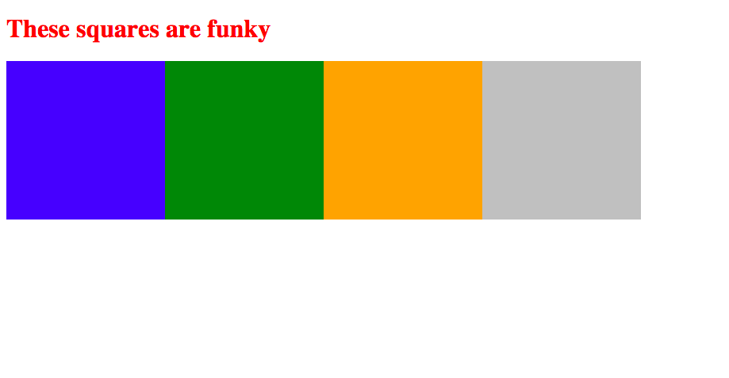

# dom-query-function

Writing `document.getElementByID()` and `document.getElementsByClassName()` every time you want DOM nodes is tedious. Let's abstract that a bit with a new function.

* Define a function called `$` that takes one string as an argument. The one string can be a simple CSS selector (class, id, or element).
* The function should determine if the selector is a class, id, or element selector, then use the appropriate DOM traversal to return DOM nodes.

Example:

```
$('.foo');
// => ['<div class="foo">...</div>', '<section class="foo">...</section>']

$('button');
// => ['<button>...</button>', '<button>...</button>']

$('#foo');
// => <button id="foo">...</button>
```

Use the comments as a reference.  Define your function $, and manipulate the html to look like below.


