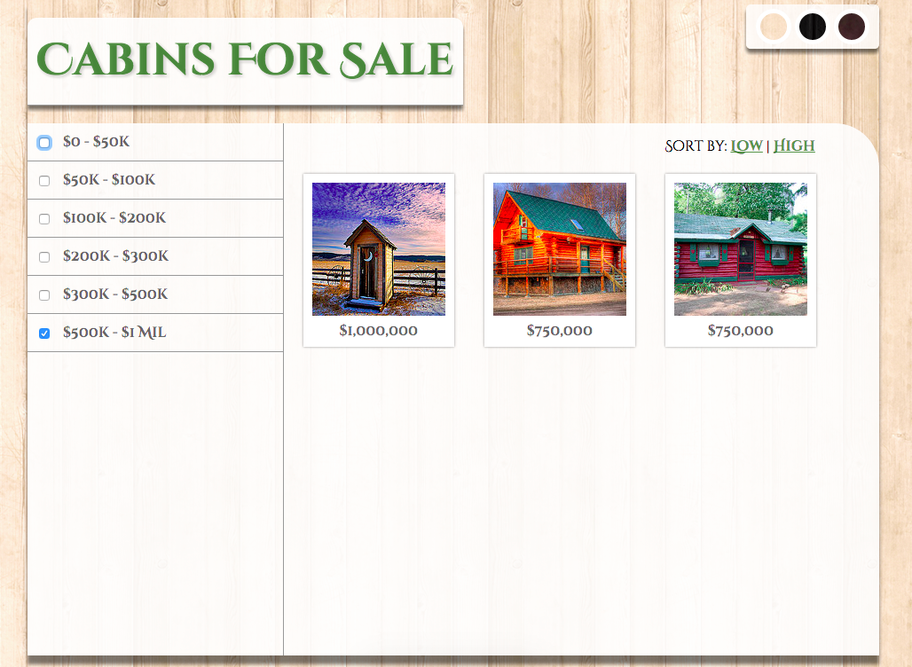

## jQuery Filtering && Pagination

In this repository, you will practice implementing a filtering system on a set of DOM attributes.

You will use click handlers, data-attributes, and whatever other means possible to filter cabins based on their price. **DO NOT EDIT THE HTML**.

### Iteration Zero | Poking Around

-  Add three new cabins to the listing. Each cabin should have a price and follow the naming structure and patterns that are currently present.
  -  Add these cabins at the end of the listing.
  -  You can find [creative commons images here](http://search.creativecommons.org/)
-  Implement a feature which will [toggle the background image](http://api.jquery.com/css/) on the `body` attribute. When clicking the dark-wood circle, it should add the `dark_wood.png` as the background image. When clicking the lighter wood circle, it should add the `tileable_wood_texture.png` back as the background image.
-  Add a new option to the background toggle that changes the background to the `forest.jpg` image. The circle should appear to the right of the dark button, and should follow the same patterns/styles as the other two buttons.
  -  When the forest image is being applied, also apply `background-size: cover` so that the image does not stretch. The `background-size: cover` should only be applied when the forest is set as the background.

### Iteration One | Sorting

-  Implement a toggle feature which will [sort](https://developer.mozilla.org/en-US/docs/Web/JavaScript/Reference/Global_Objects/Array/sort) the cabins from high to low and vice versa.
  -  When clicking the `Low` link, sort the cabins from low to high.
  -  When clicking the `High` link, sort the cabins from high to low.
    -  When clicking these links, the url should _not_ have `/#` in the url. See [preventDefault](https://developer.mozilla.org/en-US/docs/Web/API/Event/preventDefault).
    -  The [html](https://api.jquery.com/html/) method may be useful here.

### Iteration Two | Showing One Price Range

-  When clicking a price range from the sidebar, [show](http://api.jquery.com/show/) only the images that fall within that price range; or [hide](http://api.jquery.com/hide/) those that are _not_ within that filter. For now, only worry about having one filter clicked at a time.
-  Your sorting functionality should still work!
-  When building this feature, think of what it would take to add a new price range filter. Would you have to add more code to handle prices from 1Mil - 2Mil? Could we build an object that would help us here?

### Iteration Three | Filtering For Multiple Price Ranges

-  Now, when multiple filters are clicked, show cabins that fall within all clicked filters.
  -  If 0-50k && 500k - 1Mil are clicked, it should show all homes between 0-50k and all homes between 500k - 1mil
-  Change one of your homes to have a price of $1,500,000 dollars, and add a new filter for 1Mil - 2Mil. Does your code still work? Did you have to add anything to your javascript file?
  -  Before moving forward, see if you can write your script so that you could add any number of filters in the HTML, and not have to change your javascript.

### Iteration Four | Stretch Goal: Pagination

-  Update the HTML so that all the cabins fall within the same price range. Next, implement a pagination feature which only displays 6 cabins at a time. Users must click a "Next Page" button to see the next 6 images. Your filtering functionality should still work.

## Useful Snippets

-  Use `$("input:checked"))` to select all checkboxes that are currently selected.
-  It may be helpful to build an object which maps houses to their respective price category. This may be similar to the [Historical Life Expectancy Exercise](http://eloquentjavascript.net/code/#5.3)
-  You can also select attributes based on their input values, `$("input[value='onebilliondollarz']")`
-  The [attr](http://api.jquery.com/attr/) method can both _get_ and _set_ attribute values. `$(this).attr("data-price")`

Image attribution can be found in images.md
