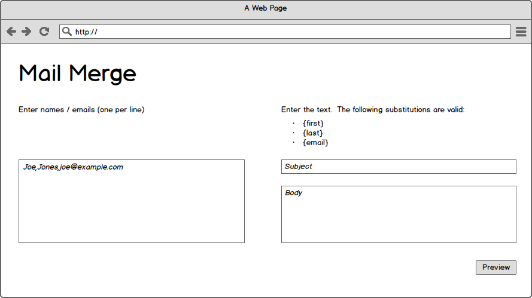
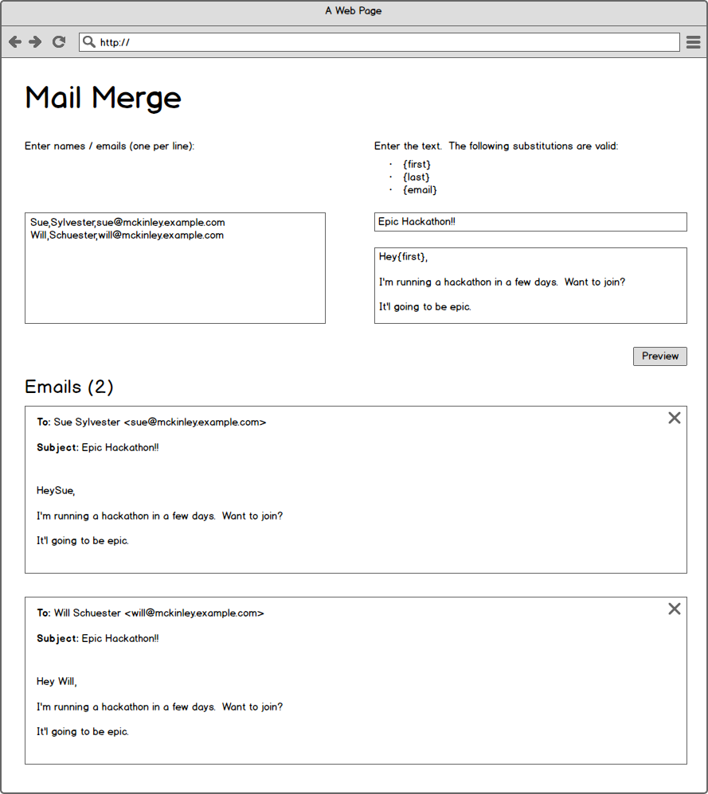

# Mail Merge

This project will test everything you know about Express so far, and will require many of the skills you'll need to have in order to write a fullstack application.  It will require you to:

- Create an HTML form
- Style the form to roughly look like the wireframes
- Handle the form data in a route
- Write an interesting algorithm in a separate file and connect it with `module.exports`
- Pass data from the route to the template
- Iterate over the data passed to the template

## Setup

Generate a new Express app and choose a templating language you have not used yet, like `hbs`, `hogan` or `jade`.

Don't forget to pass the `--git` flag!  Then install your dependencies (`npm install`) and run the app.

## Organization

This project will have both _server-side_ and _client-side_ javascript.  It can be confusing to know what code runs where.  So, for this project, please put all of your _server-side_ logic in `lib`, and all of your _client-side_ javascript in `public/javascripts`.

## Wireframes





## Stories

**Users should see a properly formatted form**

```
When a user goes to the home page
They should see a two-column layout
And each field should have a placeholder value
And the "recipients" field should be autofocused
And the preview button should align with the right-edge of the subject/body fields
And the "recipients" field height should be equal to the subject/body fields
And the whole page should have some padding
```

**When users preview mail messages, the form values remain filled out**

```
When a user fills in the form and submits it
Then the values they filled in the form fields should remain filled-in
```

NOTE: pay attention to the alignment / spacing and bold characters.

**Users can preview mail merge messages**

```
When a user fills in a list of people
And fills in a subject and a body
And clicks "Preview"
Then they should see a list of messages
```

Message bodies and subjects can have mail merge fields like `{first}`, `{last}` and `{email}` that get substituted for each user's first, last and email field.

Message bodies should have their newlines replaced with `<br><br>`.

**Users can remove messages client-side**

```
When a user previews their mail merge
Then clicks the "X" by a given message
Then the user should see the entire message div disappear
```

**When a user removes a message, the message count updates**

```
When a user clicks the "X" by a message
Then the message count should go down by one
```

## Technical Notes

For the css, consider using markup like this:

```html
<div class="row">
  <div class="column">column one stuff goes here</div>
  <div class="column">column two stuff goes here</div>
</div>
```

You can style your columns to have a `float: left` and your rows to have a `clear:both`.

Showing the messages after submitting the form will require both a `for` loop and `if` statement in jade.

For adding event listeners to the "X"s there are a few ways you can do this:

- loop through all of the "X"'s on the page with `document.querySelectorAll()` or `document.getElementsByClassName()` and add an event listener to each
- add an event listener to a container div, and use `Event.target` to figure out which `div` to delete.

Also be sure that there are no javascript errors when the page first loads (and there are no messages yet).

## Resources:

- https://developer.mozilla.org/en-US/docs/Web/API/Event/target
- https://developer.mozilla.org/en-US/docs/Web/API/Element/className
- https://developer.mozilla.org/en-US/docs/Web/API/Element/classList
- https://developer.mozilla.org/en-US/docs/Web/Guide/API/DOM/Locating_DOM_elements_using_selectors
