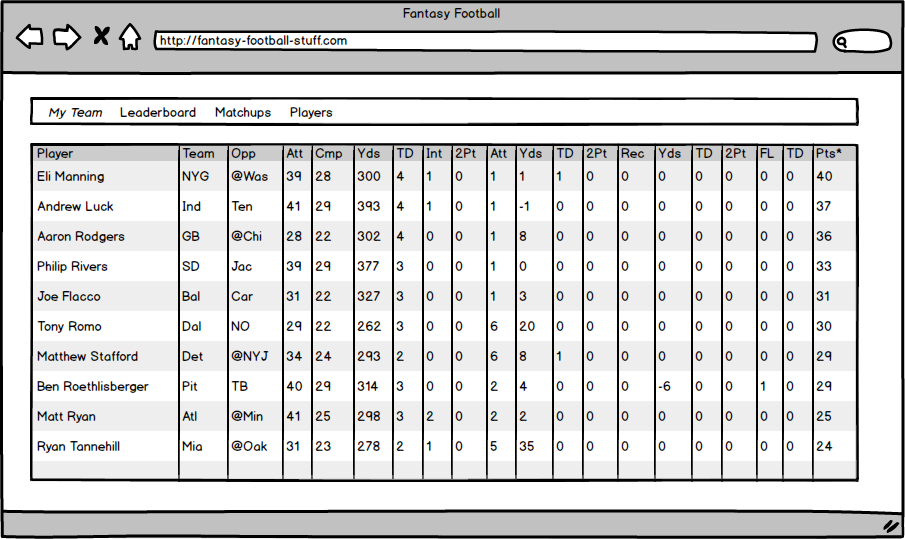
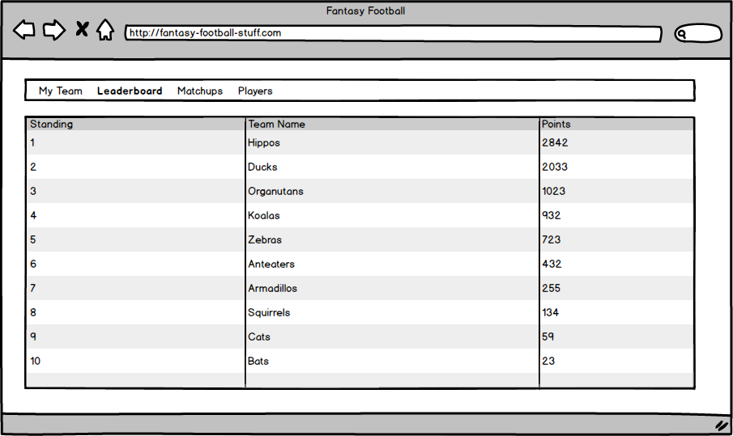
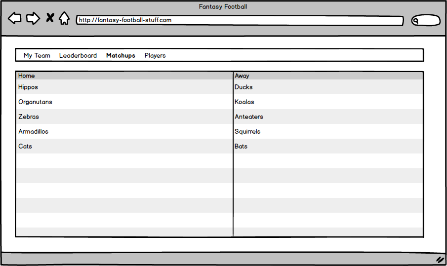
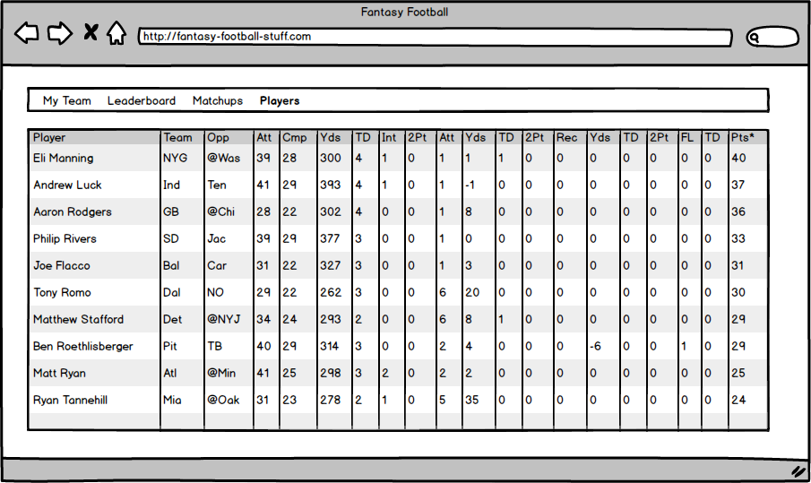

## Introduction

Hey Guys,

I need help, I told my friends I could build this fantasy football league
management application, but it is... HARD.

Could you help me model my data? Oh, and a barebones app. I am having my
designer friend make me a great UI, so don't worry about making it look nice.

Maybe you guys could like whiteboard a data model, and then build up a database.
After you have the database I'll take a look and make sure it is what I had in
mind.

I have sketched out some of the data that I think you will need. Keep in mind
there is the real NFL data and the fantasy data.

I have done a little work for you, on the app too...
`rails new fantasy-football-startup-workshop`

## NFL Data

- Teams
- Players
- Weekly Stats
- Games
- Weeks
- Injured List

## Fantasy Data

- League
- Users
- Teams
- Players
- Points
- Draft
- Starting Lineups
- Matchups

UI for team view:

UI for leaderboard view:

UI for matchups view:

UI for players view:

