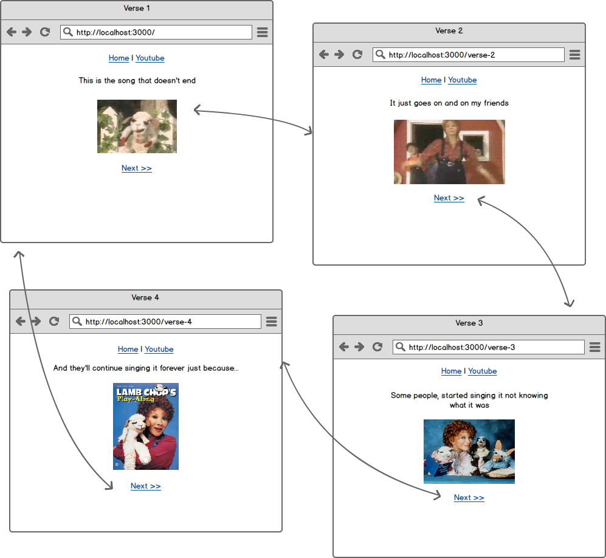

# The song that doesn't end

Based off of https://www.youtube.com/watch?v=HNTxr2NJHa0 :)

Creating a new express app requires a lot of steps, such as:

- Creating the directory
- Adding the .gitignore
- Running `npm init`
- Installing express and ejs
- Writing some boilerplate code in `app.js`

That's a bit of a chore, and since you'll be creating a lot of apps in the next few weeks, there's a great tool available to help make that go faster - the Express Generator.

## Setup

First, visit http://expressjs.com/starter/generator.html and read through the page.  To get setup, simply install the generator as a global npm package:

```
npm install express-generator -g
```

Then you can `cd` into your `workspace` and generate a new app with `express`:

```
express my-new-app
cd my-new-app
npm install
nodemon
```

Then visit [http://localhost:3000](http://localhost:3000) and you'll see your express app running!

## Where are the routes?

Notice that you have a LOT of stuff in `app.js` - you'll learn what all those things do soon enough.  For now, just notice that the routes (like the home page), are not defined in `app.js` anymore - they are in separate route files, like `routes/index.js`.  That's OK - you can just make your changes there from now on.

So instead of writing this in `app.js`:

```js
app.get('/some/path', function (req, res, next) {
  // your code here...
})
```

You'd write this in your `routes/index.js`:

```js
router.get('/some/path', function (req, res, next) {
  // your code here...
})
```

## Where's the .gitignore?

Remember how above we said that it does some boilerplate for us?  Well if you want a nice .gitignore file, you'll have to tell it something else.  `cd` up a directory and remove this app - you'll recreate it in a minute:

CTL+C to close out of `nodemon` then run:

```
cd ..
rm -rf my-new-app
```

Now you can recreate it, but pass it the `--git` flag:

```
express --git my-new-app
cd my-new-app
ls -la
```

Cool!  The .gitignore file is there, and it has `node_modules` in it already.

## Uh... What's jade?

Jade is just another templating language, like `ejs`.  It comes with jade configured by default, and there are several others it supports:

- http://www.embeddedjs.com/
- http://jade-lang.com/
- https://github.com/barc/express-hbs
- https://www.npmjs.com/package/hjs

For now, let's stick with EJS for this project.  So to do that, blow away that directory and redo it with the `--ejs` flag:

```
cd ..
rm -rf my-new-app
express --git --ejs my-new-app
cd my-new-app
npm install
nodemon
```

Now you are ready.

## Sending data to the view

Let's say you have an EJS template named `say_it.ejs` that looks like this:

```html
<p>
  <%= message %>
</p>
```

That `<%= %>` syntax says "define a placeholder for a value".  That value will be passed down from the routes via the `locals` object, like so:

```js
router.get('/some-page', function (req, res) {
  res.render('say_it', {message: "Hello"})
})
```

When the user goes to `/some-page`, your express app will generate the following html:

```html
<p>
  Hello
</p>
```

## Write some code!

With what you know from above, and what you know about HTML and CSS, build an app that satisfies the following stories:

### Basic

NOTE: pay careful attention to the URLs and make your URLs match.

```
Users should be able to see the first verse on the homepage
```

```
Users should be able to see a page with the second verse
The homepage should link to the second verse page
```

```
Users should be able to see a page with the third verse
The second verse page should link to the third verse page
```

```
Users should be able to see a page with the fourth verse
The third verse page should link to the fourth verse page
The fourth verse page should link to the homepage
```

You can grab the images from here:

* http://rophydoes.rintin.com/wp-content/uploads/2011/01/lambchop1.jpg
* http://i.ytimg.com/vi/1_47KVJV8DU/mqdefault.jpg
* http://media-cache-ak0.pinimg.com/236x/4d/61/6c/4d616c5f67a37d1b7db7acc79a3dcf03.jpg
* http://media-cache-ak0.pinimg.com/236x/75/a1/d4/75a1d4cba1954c1abee9b4bd85d21de9.jpg


### Make the pages more dynamic

```
Only use a single route to serve all pages (using if statements in your route)
```

Use what you know about path params,`res.render`, the locals object and the template to refactor your code so that the urls (`/verse-1` etc...) stay the same, but all of your views are handled by a single route.

HINT: you can pass multiple properties/values in the `locals` object that you pass to `res.render`.

## Wireframes


