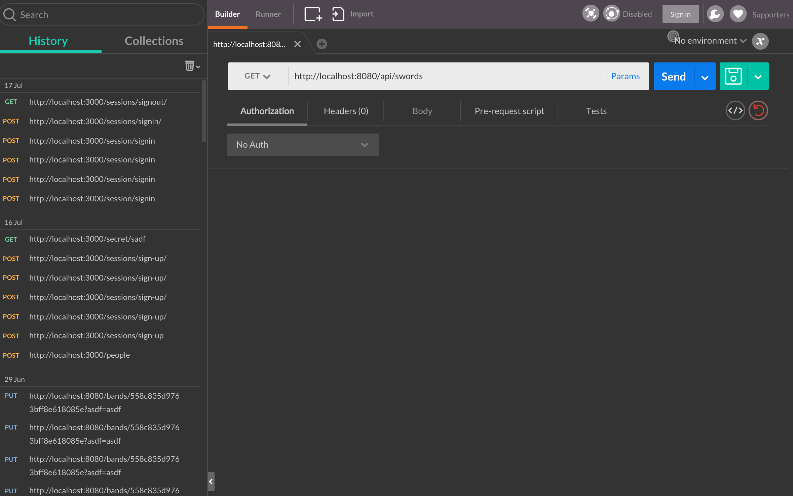
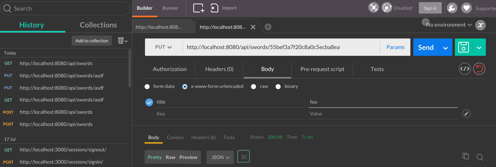

# REST API with Express

Today we’ll learn how to build a RESTful API with Express and how to test the API manually with Postman. Don't worry: testing the API with Postman is a necessary skill, but we'll also learn how to do automated testing later.

## Objectives
* Build an API with Express
* Manually test the API with Postman

Here's what the API will do:

* Handle CRUD for a resource (this lesson uses swords, but you should choose something else.)
* Have a standard compliant URL structure (`/api/swords` and `/api/swords/:sword_id`)
* Use semantic HTTP verbs (GET, POST, PUT, and DELETE)
* Use semantic status codes to keep clients informed
* Return JSON data to all requests

# Clear the stage

## What
In the past, we've `consumed` APIs as the client, but it's likely that the APIs you've consumed didn't support full CRUD actions. So, in some ways there are parallels (the API provides data to the client when it gets a request), but this API is going to support much more than simple get requests.

## Why
Knowing how to build and consume your own application APIs is 100% neccisary to provide data to fullstack, single page apps with thick clients like Angular, Ember, React, etc.

## Setup

Close down any other projects you're working on. Get out your favorite note taking mechanism, and take a deep breath. Quickly review all of the headers in this document, then start reading from the top.

# Getting Started

Let’s look at all the files we will need to create our API. We will need to define our Node packages, start our server using Express, define our model, declare our routes using Express, and last but not least, test our API.

Here is our file structure. We won’t need many much!

```
    * app/
    * node_modules/
    * package.json
    * app.js
    * routes/
    *   swords.js
```

## Installing dependancies

We're **not** going to use the express generator to create our API because it comes with lots of view related modules. Instead, we're going to start this like any other node app: with `npm init`.

Run `npm init` inside the root of a newly created application folder.

We're going to need `express`, `monk`, and `body-parser` to get going, so install those with npm. **Note: Be sure to use the --save flag so they are added to package.json.**

After installing these, your package.json should look something like this:

```
// package.json

{
    "name": "express-api",
    "main": "app.js",
    "dependencies": {
        "express": "~4.0.0",
        "monk": "~1.0.1",
        "body-parser": "~1.0.1"
    }
}
```

Crack open the app.js file to setup our app.

```
var express    = require('express');
var bodyParser = require('body-parser');

var app = express();

app.use(bodyParser.urlencoded({ extended: true }));
app.use(bodyParser.json());

var swords = require('./routes/swords')

app.use('/api/swords', swords);

app.listen(process.env.PORT || 8080);
console.log('Woot, server started');
```

All of the above code should look familiar from the express generator you used before. It's the absolute minimum needed to get an express app going. If you haven't already, create a `routes` directory for your application routes.

## Simple routes

You're going to set up routes like you do any others, with the exception of two things.

1. The response will not use the `render` method; instead, it's going to use the `json` method. Take a few moments to read the [Express docs on this method](http://expressjs.com/4x/api.html#res.json).
2. You will include explicit, semantic HTTP status codes.

```
var express = require('express');
var router = express.Router();

router.get('/', function(req, res) {
  res.status(200).json({ message: 'rawr! you did it!' });
});

module.exports = router
```

Let’s make sure that everything is working up to this point. We will start our Node app and then send a request to the one route we defined to make sure we get a response.

Let’s start the server. From the command line, type:

```
$ nodemon app.js
```

Note: Why doesn't `npm run start` work here? What would you do to make it work?

You should see your app start up in the terminal.

Now that we know our application is up and running, let’s test it.

## Testing Our API Using Postman

Postman will help us test our API. It will basically send HTTP requests to a URL of our choosing. We can even pass in parameters (which we will soon) and authentication (which we won’t need for this tutorial).

Open up Postman to begin.



All you have to do is enter your request URL, select an HTTP verb, and click Send. Simple enough right?

Here’s the moment we’ve been waiting for. Does our application work the way we configured it? Enter http://localhost:8080/api/swords into the URL. GET is what we want since we just want to get data. Now click Send.


Win. We've just confirmed everything is working as expected. Let’s wire up our database so we can start performing CRUD operations on some swords.

## Creating a Swords Collection

Just include the usual monk configuration code at the top of your swords route.

```
var express = require('express');
var router = express.Router();
var db = require('monk')('localhost/swords')
var Swords = db.get('swords')

...

module.exports = router
```

Notice how the `Swords` variable is using a capital S? We're going to do this to help us differentiate the swords collection instance (Swords) and other uses of the word "swords" in our application.

## CRUD Routes

We will use an instance of the Express Router to handle all of our routes. Here is an overview of the routes we will require, what they will do, and the HTTP Verb used to access it.

| Route               | HTTP Verb | Description                  |
|---------------------|-----------|------------------------------|
| /api/swords          | POST      | Create a sword.               |
| /api/swords/:sword_id | GET       | Get a single sword.           |
| /api/swords/:sword_id | PUT       | Update a sword with new info. |
| /api/swords/:sword_id | DELETE    | Delete a sword.              |

This will cover the basic routes needed for an API. This also keeps to a good format where we have kept the actions we need to execute (GET, POST, PUT, and DELETE) as HTTP verbs.

## Semantic HTTP Status Codes

Before you proceed, you should take the time to complete the require [Status Code](https://github.com/gSchool/http-status-codes) lesson. It will provide context for the remainder of this lesson. So, take note of where you are in the development process on this app, then click the above link to start learning about status codes.

## Creating the Basic Routes

 Getting a sword and creating a sword will both be handled using the /api/swords route, but each with different HTTP methods POST and GET respectively.

### Creating a Sword POST /api/swords
We will add the new route to handle POST and then test it using Postman.

```
// routes/swords.js

router.post('/', function(req, res) {
  Swords.insert(req.body, function(err, sword) {
    if (err) {
      res.send(err);
    }
    res.status(201).json(sword);
  });
})
```

To test this out in Postman you will need to:
1. Change GET to POST
2. Select the Body section to add form data
3. Select x-www-form-urlencoded (the same type of data forms send)
4. Enter the key value pairs you want to send to the API
5. Then click Send

We get back a successful message (notice the 201 created status code) that our sword has been created. Let’s handle the API route to get all the swords so that we can see the sword we just created.

## Getting All Swords
This will be a simple route that just returns all of the swords from the database. Reference the above table to determine what route and HTTP verb should make that happen... Take your time. I'll wait. :) Once you decide on the route, proceed to the next section.

### GET Swords Route
You should have decided on a GET require for the index route. We already defined a route GET at the swords index, so lets change that up a bit.

```
router.get('/', function(req, res) {
  Swords.find({}, function(err, swords) {
    if (err) {
      res.send(err);
    }
    res.status(200).json(swords);
  })
});
```

Testing this one is simple. Just send a GET require to the `api/swords` route.

## Routes with dynamic segments

Now that the index route is covered, it's time to work with routes that use the resource ID.

This route will:
* Get a single resource
* Update a single resource's info
* Delete a resource

## Get a single resource

Reference the chart above to figure out what route should be responsible for this, then consider the following code:

```
router.get('/:id', function(req, res) {
  console.log(req.params.id);
})
```

Read the above code for a few minutes and try to answer these questions. You should be able to come up with an answer within 10 minutes by reading the code, and trying things in your application code.

1. How do you send a GET request to invoke this route handler?
2. What information does the params tell us about the request resource?
3. How then would we locate that resource in the database?
4. Once located, what should be done with the data?

## Answers

* A1: Send a GET request to `localhost:8080/api/swords/someidnumber`
* A2: It should provide the id of the resource as made availible in the URL. It can be accessed with `req.params.id`
* A3: Once you have the ID, it's just a matter of searching for that resource with monk.
* A4: Well, it's a GET request for a sword with a specific ID, so you should send back the sword. That's what the client wants! :)

The solution code looks something like this:

```
router.get('/:id', function(req, res) {
  Sword.findOne({_id: req.params.id}, function(err, sword) {
    if (err) {
      res.send(err)
    }
    res.status(200).json(sword)
  })
})
```

You should send a GET request to this route (see answer A1) to confirm it's working before moving on. Just note that you will need to replace "someresourceid" in the URL with an actual document ID from the database.

# Update a single resource's info

The update route is also going to be defined for the above route, but using the appropriate HTTP method. If `router.get` handles GET requests and `router.post` handles POST requests, can you guess what router method handles PUT requests? Yup. It's that simple.

```
router.put('/:id', function(req, res) {
  console.log(req.params.id);
})
```

Take a few minutes to lookup the findAndModify docs in MongoDB. It's not linked here so you can practice finding the correct docs quickly. Go ahead. Google it! :)

Given the many ways to use findAndModify, you may consider something like this:

```
router.put('/:id', function(req, res) {
  Swords.findAndModify({_id: req.params.id}, req.body, function(err, sword) {
    if (err) {
      throw err
    }
    res.json(req.body)
  })
})
```

You can test this route by sending a PUT request to 'api/swords/someid'. Use x-www-form-urlencoded to specify which document fields you want to update.



## [DELETED](https://www.youtube.com/watch?v=60T_sg9D5JQ)!

To delete a resource from the API, a DELETE request needs to be sent to the correct resource ('api/swords/someid')

You should be able to guess by now how to accept delete requests in the router. Instead of writing it out, I'm going to leave it as an exercise for you.

### Guiding questions:
1. How do you accept different HTTP methods (like DELETE) in your routes?
2. How do you delete documents from MongoDB?
3. How do you know which document to delete?
4. What status code is associated with a response for DELETE?

# Next Steps

To complete this exercise, you should:

1. complete the routes for all CRUD actions for the swords resource
2. Create new routes to manage CRUD actions for a `potions` resource.

## Stretch:
* Once this API supports swords and potions, deploy the application to heroku. Note: Why won't this work out of the box? What does the express generator give you that isn't included for heroku here? You will obviously need to configure mongolabs and env variables, but what else is missing?
* Manually testing things with Postman is tedious. Install [supertest](https://github.com/visionmedia/supertest) to test drive a third resource in your API.
* Use [axios](https://github.com/mzabriskie/axios) (or angular, or jquery, or xhr, etc.) to consume the API. Note: the static client site should be built and served from an entirely different repo. You will need to install CORS in Express, and serve the static file from a static file server (like `http-server` from npm)
