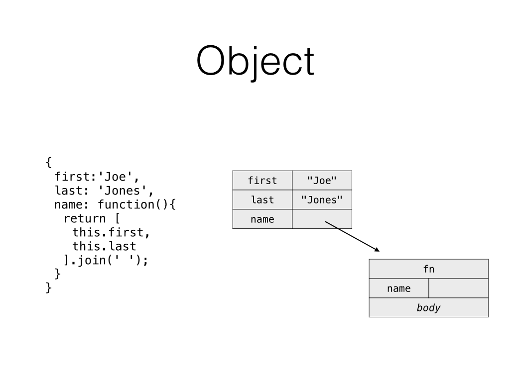
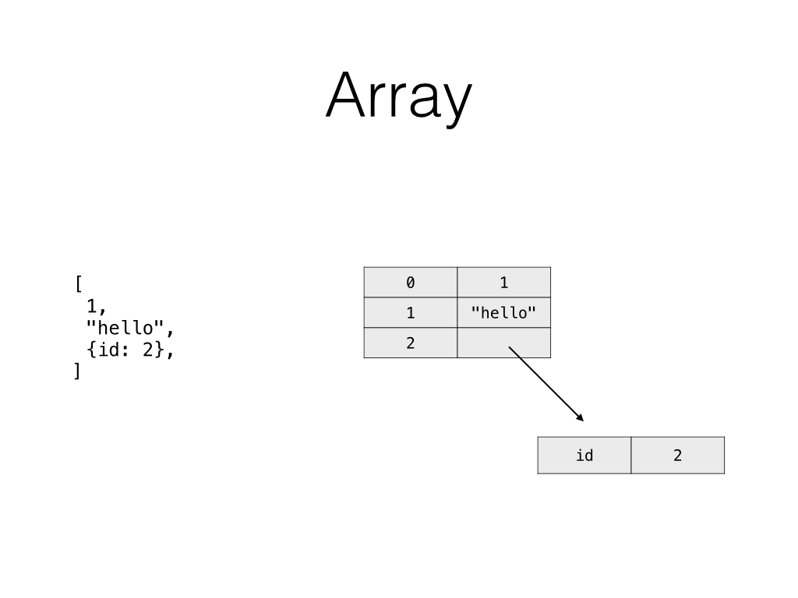
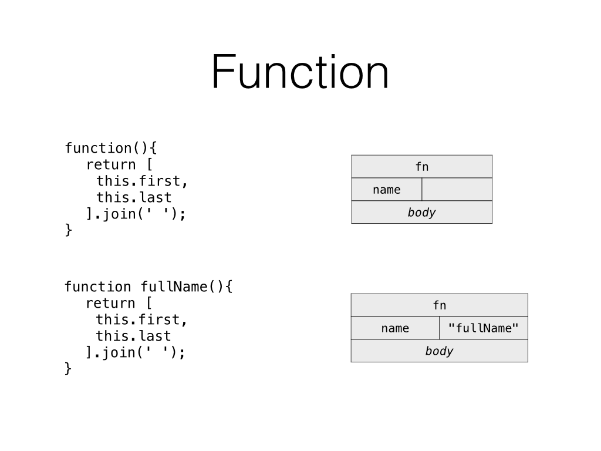
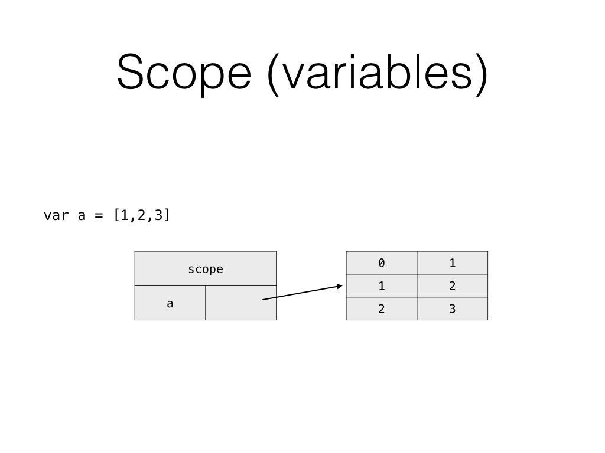
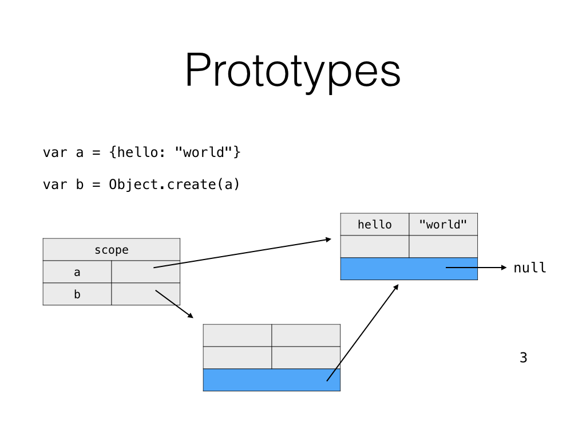
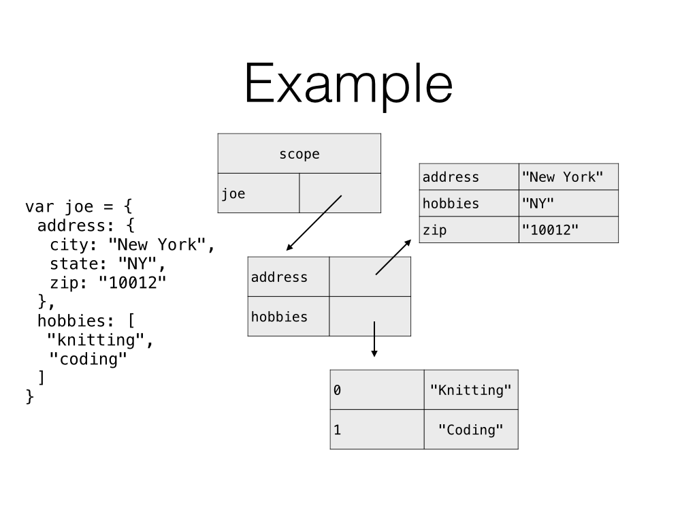

# Memory Diagrams

## Objectives

By the end of this lesson you should be able to:

- represent "static" objects, arrays, functions and variables in diagrams
- draw a diagram of the _result_ of calling a function
- explain the difference between mutable values and immutable values

## Set the stage

As you get into more complex JavaScript concepts, it's helpful to have a working mental model of how objects in the heap (in RAM) relate to each other.  Once you learn these diagrams, you can use them in service of understanding new concepts in JavaScript, such as OOP, Angular scopes, prototypal inheritance and more.

> NOTE!  This is not the type of thing you would do on a job.  These diagrams are for learning purposes only, and once you internalize them, you should no longer need to draw out code.

You'll want a whiteboard or other erasable drawing surface with plenty of space.

No need to fork / clone this.

## Mechanics

### Objects

To start, whenever you see an object, draw it as a _table_ of key / value pairs.

For values, follow these rules:

- Embed immutable values (strings, numbers, booleans) in the table for brevity
- Draw mutable values (objects, and hence arrays, functions etc...) _outside_ the table and just point to them.



> **Question:** Are mutable values really stored "inside" objects in real life in the heap?

> **Answer:** The answer doesn't really matter.  The main point here is to come up with a "working" mental model of how things look in memory that you can use as a basis to understand other more complex concepts, and this simple notation accomplishes that.

### Arrays

In JavaScript, arrays are just objects with specialized behavior.  Don't believe me?  Run this code:

```js
typeof [1,2,3]
```

Which means that representing arrays is very simple:



> **Question:** What about things like `length`?  Shouldn't we include that?

> **Answer:** We're going for a quick notation that can help you deepen your understanding of JavaScript, so no need to add extra complexity to the diagrams.

### Functions

In JavaScript, functions are also special kinds of objects.  They can have properties and prototypes just like any other object.

So like arrays, you can easily represent functions like tables.  In this case, you probably want to label the function as `fn` so it's clear that it's a function, and not a regular object.  If you want to make notes about the contents of the function, add the `body` across the bottom:



### Variables / Scope

Let's say you have a program that looks like this:

```js
var a = "hello"
var b = new Date()
```

What you are doing here is establishing a relationship between two things:  the _identifiers_ (aka variable names) like `a` and `b`, and the _values_ (like `"hello"`).  Sound familiar?  Yup - this looks just like an object!



But since variables aren't _quite_ as simple as objects, and you can't reference the scope directly, you'll probably want to label that one as "scope" to not be confused.  Same rules apply for objects:

- embed immutable values
- point to mutable values

> **Question:** Whoa... wait a minute.  Scope is pretty hard.  You have your scope, and parent scopes, and `this`... and scope changes whenever you are in a function.  This seems too simplistic and potentially harmful.

> **Answer:** Yes - with all of these representations, there's a risk of oversimplifying in some cases. In general, as you are learning, you'll likely only care about a single scope at a time (like, diagramming the result of a function, or the code inside a function with a few variables...).  Again - these are _not_ accurate representations of how things are _actually_ stored in the JavaScript interpreters - they are a close representation, a learning tool and a way to help you make sense of the world - at the point where they make it worse, stop using them :)

> As you get into closures and scope chains, this representation will scale nicely.  So yes - scope is a complex subject, but these simple diagrams can take you pretty far.


### Prototypes

Prototypes are an interesting concept.  While there are some ways you can interact with an object's prototype, prototypes are not properties, and you can't manipulate prototypes like you can a property.

So draw a dark line at the bottom to represent prototypes, and an arrow to point to the object's prototype.



### Putting it all together



## Summary

With these basic drawing tools, you should be able to represent even fairly complex, self-referential data structures, and be able to start to _see_ in your head how object references work.

Now you are ready for some [exercises](./03-memory-diagrams-exercises.md)!
