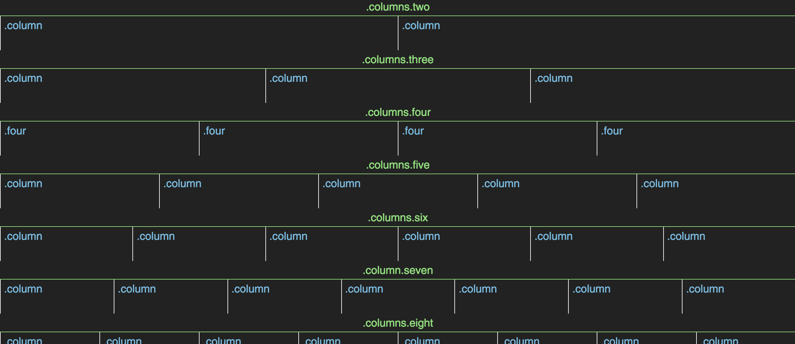
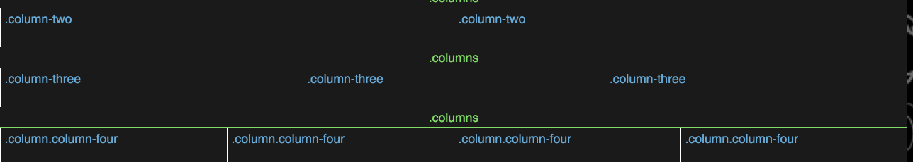

# Grids

### You should know:

1. Selector chaining
1. Selector grouping
1. Floats & Clearfixes
1. The CSS box model

### Objective

1. Decide between using a symmetrical (preview #1) and asymmetrical (preview #2) grid system.
1. In the index.html file, explain how you and your pair came to this
   conclusion. What are the advantages of one over the other?
1. There are starter styles in the app.css file. Expand on that to
   implement the system of your choice.
1. Pretend like this is a library / framework that you will share on
   github. Write HTML that demonstrates how your classes work, all the
way up to 12 columns. (See the example images below).

Preview #1:

Preview #2:

## Server
1. In the terminal, `cd` into the root of this project.
1. Run `python -m SimpleHTTPServer` to start a server.
1. Visit localhost:8000 to see the index page
