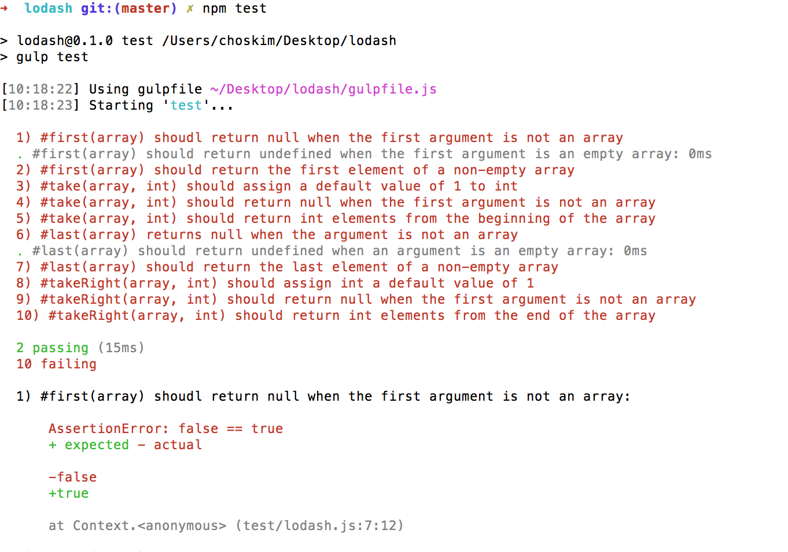

# lodash
In this assignment, we want you to re-implement some of the most popular methods found in [lodash][lodash]. This task will provide you two incredible learning opportunities: first, you'll have the opportunity to apply your knowledge of JavaScript; second, you'll learn through this experience that lodash, similar to all JavaScript libraries, are written with the same JavaScript you've been learning!

If you're unfamiliar with lodash, it's [a popular utility library][popular-utility-library] written in JavaScript. Inside of it, you'll find a collection of methods, such as [forEach()][for-each], which replaces the boilerplate code that developers often find themselves writing--e.g., code that iterates on every item of a collection. 

Here's an example:

```javascript
// Without lodash, you have to create your own implementation of forEach.
function forEach(arr, callback) {
  var i;

  for (i = 0; i < arr.length; i++) {
      callback(arr[i], i, arr);
  }

  return arr;
}

// "one" 0 ["one", "two", "three"]
// "two" 1 ["one", "two", "three"]
// "three" 2 ["one", "two", "three"]
// ["one", "two", "three"]
forEach(["one", "two", "three"], function(val, index, arr) {
  console.log(val, index, arr);
});


// With lodash, you're provided an implementation of forEach.
// "one" 0 ["one", "two", "three"]
// "two" 1 ["one", "two", "three"]
// "three" 2 ["one", "two", "three"]
// ["one", "two", "three"]
_.forEach(["one", "two", "three"], function(val, index, arr) {
  console.log(val, index, arr);
});
```

## Instructions
To complete the work in this repository, please follow the following six steps:

### 1 of 6: Fork and Clone
Fork and clone this repository to here: 

```javascript
~/workspace
```

If `workspace` doesn't exist, create it: 


```javascript
mkdir ~/workspace
``` 

### 2 of 6: Download npm Packages
This repository contains external libraries, which will enables us to include a test suite. You'll need to navigate to your cloned repository and type the following command:

  ```javascript
  npm install
  ```

### 3 of 6: Run Tests
After all packages have been downloaded, type the following command to run your tests:

```javascript
npm test
```

Notice the following output:


### 4 of 6: Make A Test Pass
To make a test pass, you'll first identify a test you want to pass. Once you determine the method associated with this test, you'll need to open `./lodash.js` and find the method that corresponds with the method failing in your tests. 

After you've created an implementation of a method in `./lodash.js`, type this command:
    
```javascript
npm test
```

If your implementation is correct, the test you want to pass will change from failing to passing (i.e., red to green). This is a good moment to commit your work.

### 5 of 6: Make All Tests Pass
Repeat the last step until all tests pass. 

### 6 of 6: Submission
When you're done, push your work to your forked repository. Then copy the URL of your forked repository and paste it into the LMS (learning management system).

[lodash]: https://lodash.com
[popular-utility-library]: https://www.npmjs.com/package/lodash#installation
[for-each]: https://lodash.com/docs#forEach
