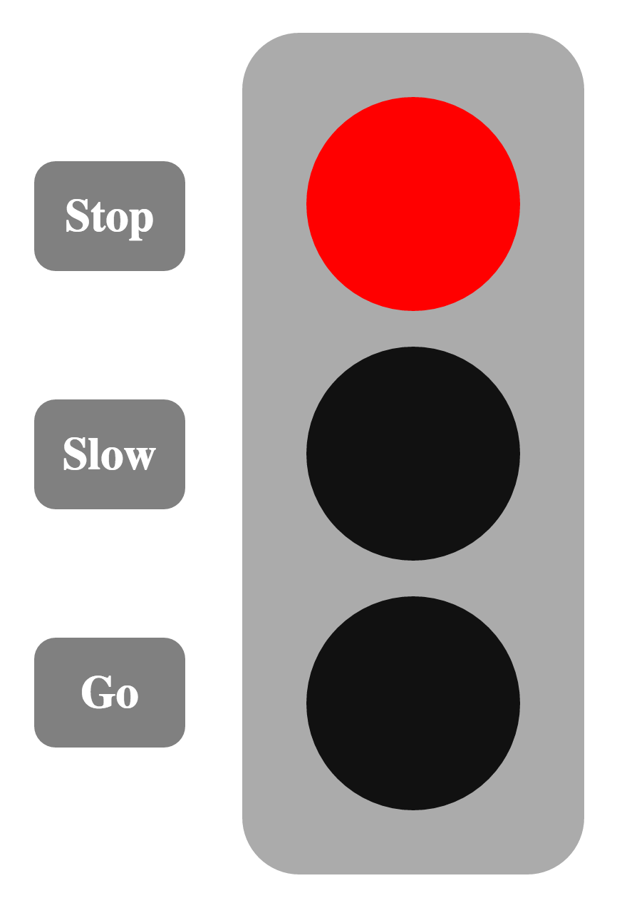

# Stoplight Exercise

As always, fork and clone this repo. Submit a Pull Request when you are done.

## Stoplight

Wire up the buttons to the left of the stoplight to toggle the on/off state of each bulb.

## Hints

* Retrieve a DOMElement with [`document.querySelector`](https://developer.mozilla.org/en-US/docs/Web/API/Document/querySelector) or similar method
* Attach event listeners with [`addEventListener`](https://developer.mozilla.org/en-US/docs/Web/API/EventTarget/addEventListener)
* Set the color of a bulb with [`background-color`](https://developer.mozilla.org/en-US/docs/Web/CSS/background-color)
